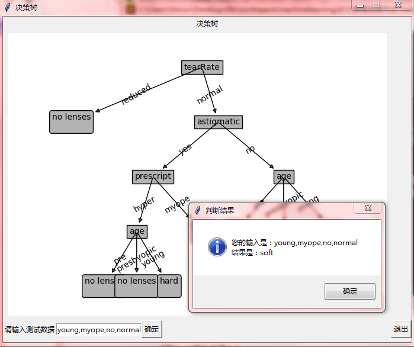

# ID3算法--Python 3.6实现

# 项目说明
该项目图形界面采用python的tkinter库编程实现。采用MVC模型，显示用户界面的视图与执行算法逻辑相分离。采用读取数据集的方式，最后画出决策树并显示在用户界面。并将画的决策树图片保存在可执行文件同目录。
.exe文件运行较慢，可以通过终端运行treeWidget.py
## 数据集说明
采用著名的隐形眼镜数据集。执行exe文件时需要将数据集放在同一个目录下。运行程序即可以根据输入测试数据判断推荐的隐形眼镜类型。

该数据集的标签为：'age','prescript','astigmatic','tearRate'
用户输入格式如下：young,myope,no,normal
## 执行效果

